# DCDC-BUCK电源电路设计简单入门

# 前言

要了解DCDC-BUCK电源电路的设计方法，就得先了解DCDC-BUCK电路的基本模型

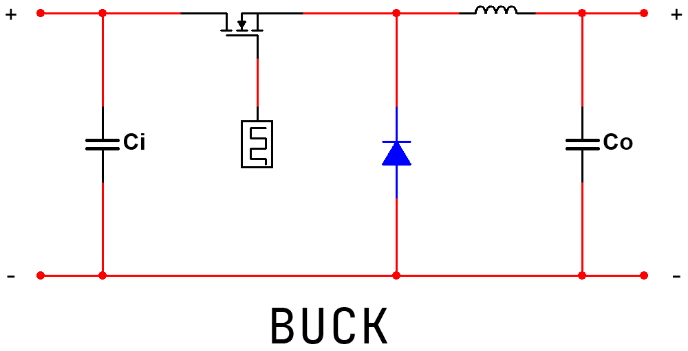

如上图所示，此为**异步BUCK电路**的简单等效模型，之后的内容都将围绕此图展开。

<aside>
💡

实际电路相较该模型电路要多一个自举电容，此处要注意

</aside>

# 芯片选型

DCDC芯片相较于LDO芯片种类繁多，基本市面上都能找到心仪的芯片。一般主要看**开关率、输入电压、输出电压、输入电流、输出电流、保护功能、输出纹波、转换功率**。接下来将一一解释这些参数的含义。

## 输入电压与输出电压

这两个的意义不必多说。主要介绍一下输入与输出电压的影响。

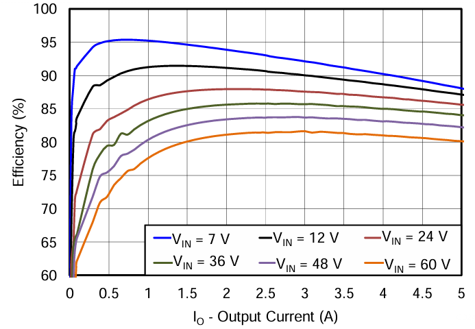

来源：TPS54560

如图所示，一般输入电压越大，芯片的转换效率也越低。

在芯片选型阶段，输入与输出电压的范围应留有余裕，不应出现“卡极限”的情况，因为在发生一些突发情况时可能会导致芯片损毁。

## 输入电流与输出电流

这两项的意义不做多解释。初学者只需知道：

- 芯片选型时输入电流与输出电流的选取应留有余裕
- 如果是大功率电路，可能需要注意输出电流是否能满足工作需要

## 保护功能

现在的芯片一般都内置了许多保护功能，如过压保护、过流保护、短路保护、热保护等功能。这些功能能有效减少意外情况的发生，提升电源电路的可靠性。**但需注意的是，不应该以“芯片已经内置了保护功能”而在外部保护电路的设计中偷懒。**如果是重要电路，仍然需要通过分立元件实现电路的保护。

## 开关率与输出纹波

要理解开关率，就要从DCDC电源芯片的工作原理讲起。

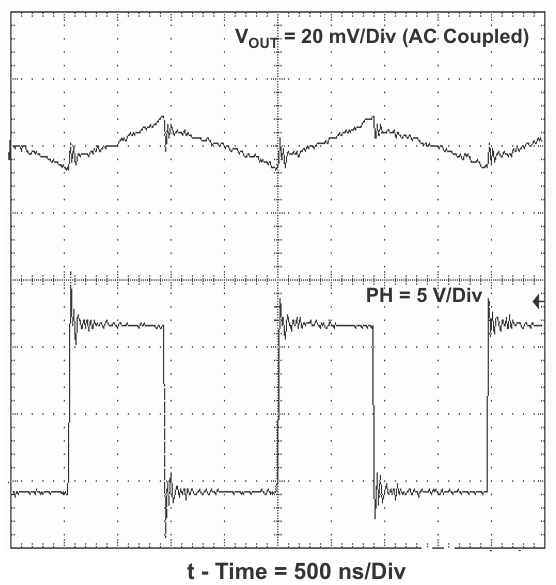

如上图所示，DCDC芯片的降压原理就是通过高速的开关，实现实现输出不同占空比的PWM波，从而实现输出的等效降压。所以顾名思义，DCDC芯片的开关率既为芯片内部的开关频率大小。需要注意的是，**一般开关率越高，输出纹波越小，转换效率也会减小。**

因为DCDC本身是通过高速开关的方式降压的原因，输出电压往往会存在较大波动，一般数十mV都属正常现象。如图中所示输出电压的波动便是纹波，实际电路中纹波收到很多方面因素影响，如DCDC芯片外部元件的摆放等。**纹波反映了电源的波动大小，自然是越小越好。**

## 转换功率

在芯片降压的过程中，无法避免的会存在损耗，例如转换为内能等其他能量被浪费掉，其中实际输出的能量与输入能量的比值既为转换功率。转换功率一般越高越好。

## 芯片选型总结

- 在选取DCDC芯片时，应根据自身需要选取输入与输出的电压与电流满足需求的芯片，其中电压与电流的选择应留有余裕避免突发情况损坏芯片。
- 开关率越高，输出纹波越小。在一些开关率可调的DCDC上则额外须注意开关率越高，转换功率越低。
- 转换功率越高越好。更高的转换功率能减少能量的浪费。
- 芯片自带的保护功能非必选项。但聊胜于无，越多的保护功能能更好的提升电路可靠性。

# 硬件电路设计

以TPS5430为例，上图为我简单设计的一个TPS5430的12V转6V电路。之后我将以此电路为基础来讲解DCDC-BUCK芯片的外部电路设计。

## 总体电路介绍

不同DCDC芯片的外部电路存在较大差异，但是仍存在较多共通之处。因此如果想要入门DCDC电源设计，可通过了解以下内容来对DCDC电源设计有个初步了解：

- **去耦电容**
- **肖特基二极管**
- **自举电容**
- **功率电感**
- **反馈回路**
- **铺铜设计**
- **电感铺铜**
- **信号隔离**
- **散热**

## 去耦电容

在靠近芯片的输入输出引脚处并联不同大小的电容到GND，可以起到滤除外界高频噪声的作用。

### 放置规则

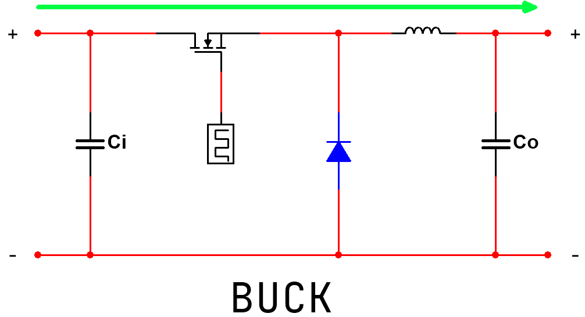

如图所示，在放置去耦电容时，应注意输入输出方向。**芯片的输入引脚靠近小电容，输出引脚靠近大电容。去耦电容离引脚越近越好。**

输出部分电容要注意在功率电感后面放置。

### 元件选型

应尽量选择**ESL较小的电容**。实际电路电容选择优先度：

**MLCC>钽电容>固态电容>高频低阻电解电容>普通电解电容**

其中钽电容不能用在输入部分，以及耐压值应**至少大于实际电压值的两倍。**

## 肖特基二极管

### 放置规则

一般尽量靠近芯片输出引脚放置，并联到GND。

### 元件选型

一般无特殊要求，主要考虑额定电流能否满足芯片输出电流大小的要求。例如TPS5430最大输出电流为3A，则可选择一个SS34.而选择TPS54560时输出电流最大为5A，则需选择SS54，或使用两个SS34并联。

如对散热有要求，可选择较大的封装。

## 功率电感

### 放置规则

与芯片输出引脚直接相连。

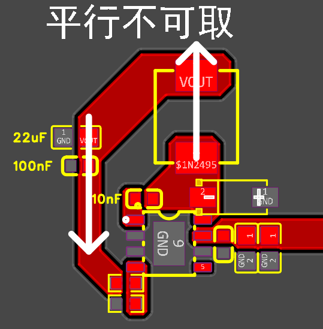

如上图所示，电感不应与反馈回路平行，因为这会导致反馈回路引入感应电动势，影响反馈回路稳定性。如果位置受限，则应保证反馈回路与点敢保证距离，或选择将反馈回路通过过孔引至PCB背面。

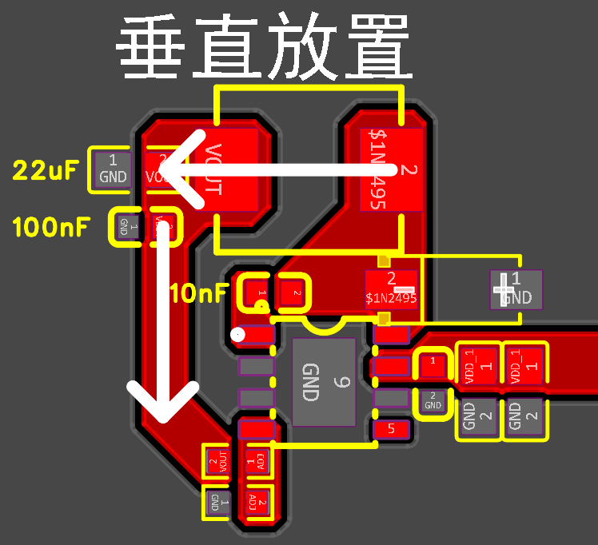

如上图所示，正确操作应保证电感方向与反馈回路方向垂直放置，能有效减少感应电动势影响。

### 元件选型

电感因为本身会引入较多的电磁干扰，因此应尽量选择**电磁干扰小的电感.**

功率电感选型优先度：

**全屏蔽电感>半屏蔽电感>非屏蔽电感**

由于屏蔽程度越高的电感价格越高，实际情况需要考虑成本选择电感。

## 自举电容

为了保证DCDC芯片的正常工作，必须要带一个自举电容。

关于自举电容的工作原理可以参考这个视频：[https://www.bilibili.com/video/BV1GgqBBDEPB/?spm_id_from=333.337.search-card.all.click](https://www.bilibili.com/video/BV1GgqBBDEPB/?spm_id_from=333.337.search-card.all.click)

### 放置规则

自举电容应连接在BOOT引脚与SW/PH引脚之间，并尽量靠近SW/PH引脚，即输出引脚。

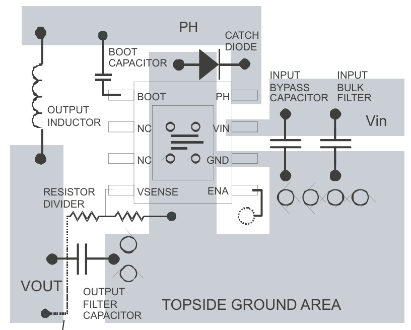

**在观阅数据手册时，一般常见自举电容靠近BOOT引脚，但实际应更加靠近SW/PH引脚更好。**

### 元件选型

一般数手册会明确写清具体参数，以数据手册为准。

## 反馈回路

.png)

反馈回路一般由两个电阻分压，来实现输出电压的控制，以及反馈输出电压的波动，有利于输出电压的稳定。

### 放置规则

**反馈回路应尽可能的短**，有利于尽可能快的反馈输出波动给芯片。同时应与电感保证垂直，减少感应电动势影响，实在不行可通过过孔将反馈回路引导至背面进行走线，或让反馈回路离电感远一点。

### 元件选型

反馈回路的电阻的公差决定了实际输出电压与理想输出电压的差值，因此对电源要求越高的电路，越要选择公差越小的电阻。

## 铺铜设计

### 走线

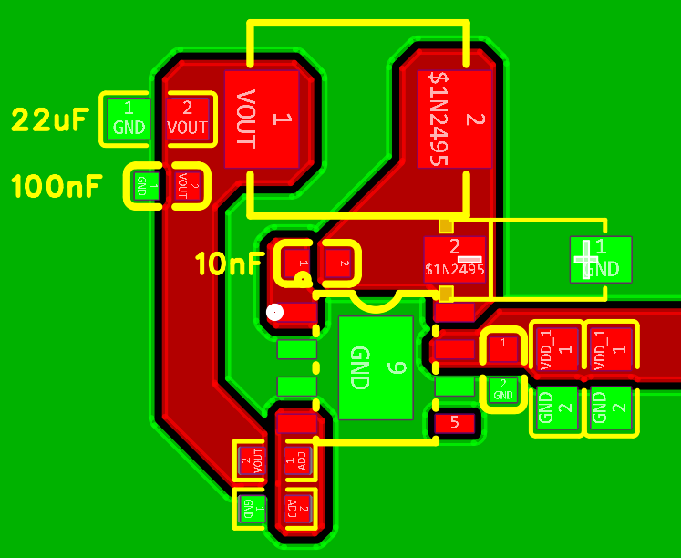

电源电路有别于其它电路，一般建议尽量采用大面积铜皮进行连接。一方面是能提升电流承载能力，另一方面是能减少线路长度。

### 热焊

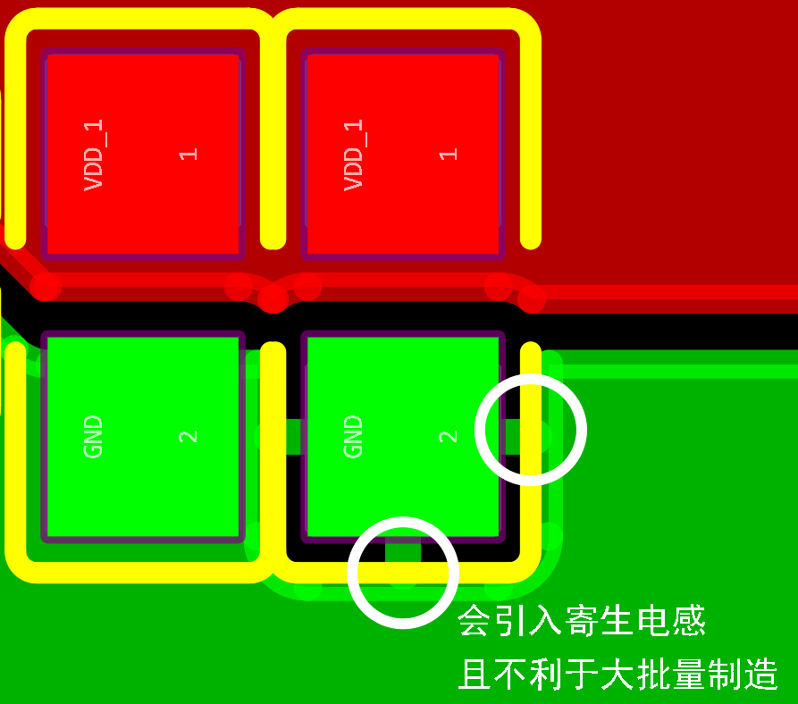

优先选择**直连**，而不是**发散**。

性能方面，发散连接会引入寄生电感。而电源电路作为PCB的命脉，在能力范围内自然要以最高规格对待。

制造方面，如果是电容之类的小型元件，一端采用直连，而另一端采用发散的话，会导致两端热阻不平衡，可能会导致“立碑”现象的发生，不利于批量生产。

## 电感铺铜

### 铺铜与否

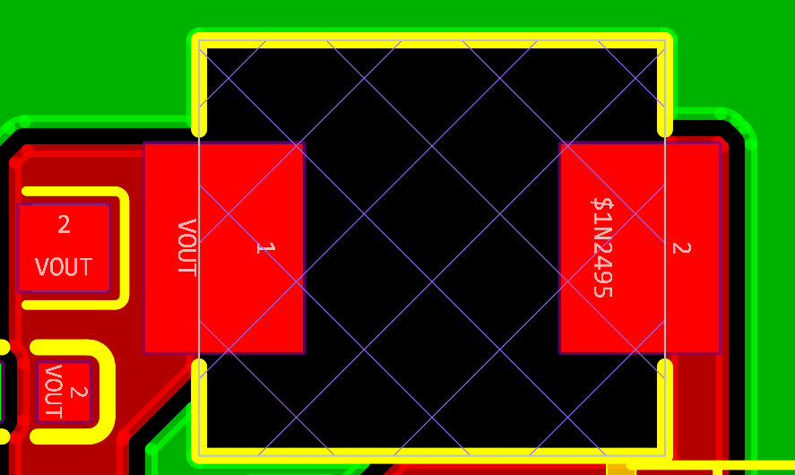

电感底部不铺铜

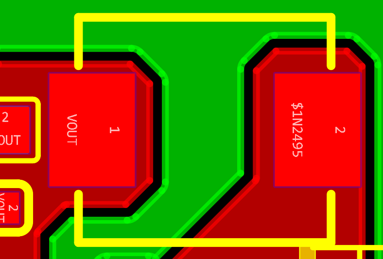

电感底部铺铜

电感底部是否铺铜一直没有一个准确的答案，是否铺铜都是因人而异。因此我仅在此介绍铺铜与不铺铜的区别，以及我的参考建议。

电感底部不铺铜

如上图所示，电感底部若敷设完整的铜层（尤其是接地铜层），可以为其高频磁场提供一条低阻抗的回路路径，从而有效约束和吸收磁场，减少对外辐射。反之，若电感底部无铜层，其产生的高频交变磁场将不受约束地扩散，极易耦合到PCB其他部分的走线或元件中，形成电磁干扰。

电感底部铺铜

如图所示，如果电感底下铺铜，则会导致“涡流效应”的产生，部分能量会转换为内能被浪费掉，因此转换功率会变低。但是也能抑制高频磁场传播，降低EMI辐射。

### 参考建议

**如果追求PCB稳定，则建议电感底部铺铜。如果在乎能量转换效率，则建议电感底部铺铜挖空。**

详细的建议参考：[https://blog.csdn.net/jiepei_PCB/article/details/147608729?fromshare=blogdetail&sharetype=blogdetail&sharerId=147608729&sharerefer=PC&sharesource=2401_88056272&sharefrom=from_link](https://blog.csdn.net/jiepei_PCB/article/details/147608729?fromshare=blogdetail&sharetype=blogdetail&sharerId=147608729&sharerefer=PC&sharesource=2401_88056272&sharefrom=from_link)

## 信号隔离

在原理图设计时，如果想要提高性能，可以将GND划分为PGND（功率地）和SGND（信号地）。

以TPS54560为例，电源芯片的ADJ/FB反馈引脚和COMP、RT开关率配置引脚划分到SGND，其余部分划分到PGND。最后在PCB设计时通过单点接地实现隔离以提升性能。

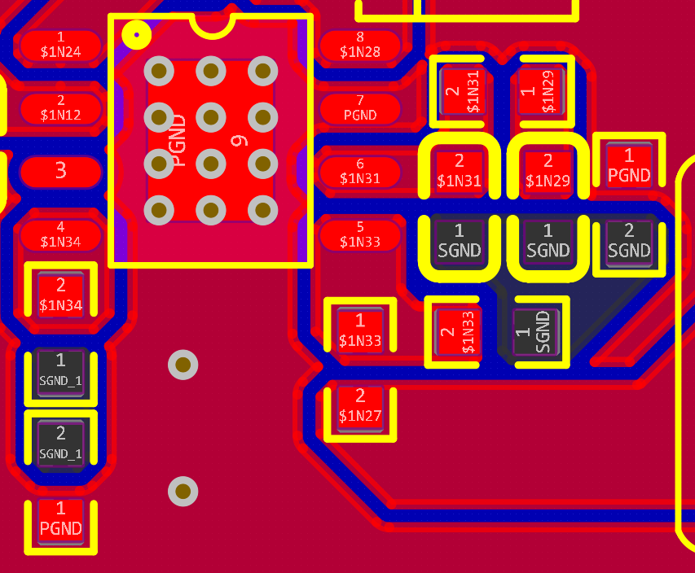

## 散热

优良的工作温度有利于电源芯片的正常工作，提高转换效率。因此，电源芯片的散热也是需要注意的一部分内容。

### 铺铜散热

一些电源芯片与PCB直接接触的一面会设计为一块与GND相连的金属接触面，有利于芯片的散热。

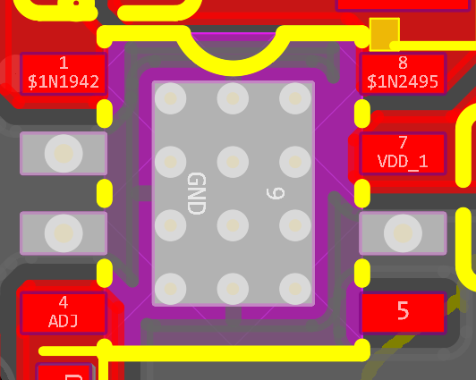

如图所示，TPS5430就存在有这样一个散热接触面。为了加强散热作用，可在此处打过孔作为散热孔。

需要注意的是，过孔的内径不能大于15mil，不然可能会导致“漏锡”。以及过孔之间的中心间距为40mil。

不同层数的PCB散热孔有一定差别。建议两层板内径12mil，外径24mil。四层板内径7.874mil，外径19.874mil。

完成之后建议芯片背面开窗处理，有利于散热。

### 散热片

嫌麻烦也可以直接购买散热片贴在芯片上面，也有不错的散热效果。

# 后记

本文章仅作为初学者DCDC电源设计入门参考，可能存在部分遗漏，还请谅解。